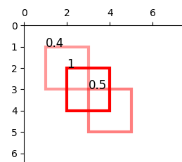
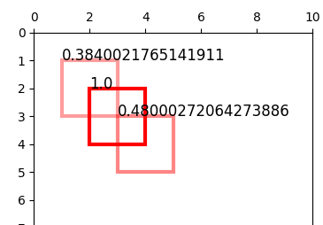

# Soft - NMS

## API

 - Crear la imagen:

    `docker build -t deepvision .`

 - Ejecutar el contenedor:
    
    `docker run --name deep --rm -p 5000:5000 deepvision`

 - Una vez el contender esta corriendo:

    - Web demo:

        Abrir [localhost:5000](http://localhost:5000)

    - Se puede pasar un archivo json por stdin:

        `cat test2.json | docker exec -i deep python3 NMS.py stdin`

    - Se puede realizar una request POST http json al puerto 5000:

        `docker exec -i deep python3 test_app.py`

    - Claro que la request se puede realizar desde afuera tambien pero requiere el modulo "requests":

        `pip3 install requests --user && python3 test_app.py`

## Ventaja de Soft - NMS sobre NMS standard

El algoritmo standard de NMS consiste en elegir bounding boxes con alto puntaje y luego eliminar las que se superponen, si es que se cumple un criterio de IOU.

El problema que Soft-NMS pretende solucionar es que no es siempre el caso en donde de dos BBs muy superpuestos, solo uno es el correcto (y el otro un falso positivo del algoritmo de ML).

Por ejemplo supongase que hay fisicamente dos objetos, uno parcialmente ocultado por el del frente (pero lo suficientemente ocultado para que IOU >= Nt). En este caso Soft - NMS no va a simplemente descartar la BB del objeto con menos puntaje, sino que va a recalcular el puntaje de la BB con menos puntaje, en base al su puntaje anterior y el valor de IOU.

Este calculo se realiza de forma tal que mientras mas superpuesta este la imagen con menos puntaje, el puntaje de esta se penalizara mas.

## Ejemplo:

El archivo test2.json representa los siguientes BBs:

Soft-NMS va a retornar lo siguiente:

En ningun momento se eliminan BBs, sino que se penalizan los que se superponen y tienen puntaje inferior de la siguiente mantera:

Tengamos en cuenta solo el rectangulo 1 y el 0.4, el nuevo score
del rectangulo 0.4 se calcula:

Fijamos un sigma de 0.5

newscore = oldscore * exp(- IoU**2/sigma)

AreaEnComun = 1

AreaUnion = 4 + 4 - 1

IoU = AreaEnComun/AreaUnion

Finalmente newscore = 0.384

## A mejorar

    - El parametro sigma podria leerse del json
